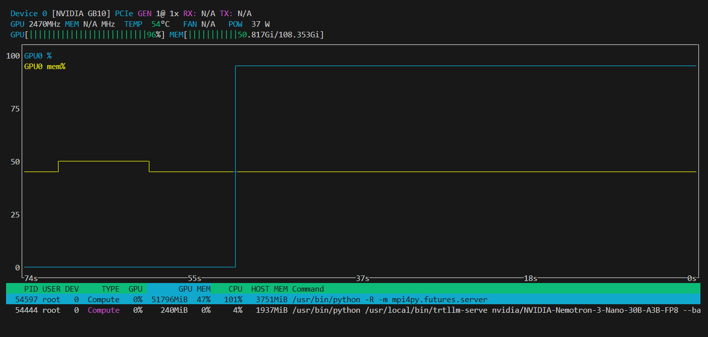

TensorRT-LLM on DGX Spark Sparks NVIDIA-Nemotron-3-Nano-30B-A3B-FP8

https://github.com/NVIDIA-NeMo/Nemotron/blob/main/usage-cookbook/Nemotron-3-Nano/trtllm_cookbook.ipynb

docker run --rm -it --gpus=all nvcr.io/nvidia/tensorrt-llm/release:1.2.0rc5 nvidia-smi

docker run --rm -it --gpus all \
  nvcr.io/nvidia/tensorrt-llm/release:1.2.0rc5 \
  python -c "import tensorrt_llm; print(f'TensorRT-LLM version: {tensorrt_llm.__version__}')"

[TensorRT-LLM] TensorRT LLM version: 1.2.0rc5
TensorRT-LLM version: 1.2.0rc5

export MODEL_HANDLE="nvidia/NVIDIA-Nemotron-3-Nano-30B-A3B-FP8"

```
docker run --name trtllm_llm_server --rm -it --gpus all --ipc host --network host   -e HF_TOKEN=$HF_TOKEN   -e MODEL_HANDLE="$MODEL_HANDLE"   -v $HOME/.cache/huggingface/:/root/.cache/huggingface/   nvcr.io/nvidia/tensorrt-llm/release:1.2.0rc5  bash -c '
    hf download $MODEL_HANDLE && \
    cat > nano_v3.yaml<<EOF
runtime: trtllm
compile_backend: torch-cudagraph
max_batch_size: 64
max_seq_len: 16384
enable_chunked_prefill: true
attn_backend: flashinfer
model_factory: AutoModelForCausalLM
skip_loading_weights: false
free_mem_ratio: 0.65
cuda_graph_batch_sizes: [1, 2, 4, 8, 16, 24, 32, 64, 128, 256, 320, 384]
kv_cache_config:
  # disable kv_cache reuse since not supported for hybrid/ssm models
  enable_block_reuse: false
transforms:
  detect_sharding:
    sharding_dims: ['ep', 'bmm']
    allreduce_strategy: 'AUTO'
    manual_config:
      head_dim: 128
      tp_plan:
        # mamba SSM layer
        "in_proj": "mamba"
        "out_proj": "rowwise"
        # attention layer
        "q_proj": "colwise"
        "k_proj": "colwise"
        "v_proj": "colwise"
        "o_proj": "rowwise"
        # NOTE: consider not sharding shared experts and/or
        # latent projections at all, keeping them replicated.
        # To do so, comment out the corresponding entries.
        # moe layer: SHARED experts
        "up_proj": "colwise"
        "down_proj": "rowwise"
        # MoLE: latent projections: simple shard
        "fc1_latent_proj": "gather"
        "fc2_latent_proj": "gather"
  multi_stream_moe:
    stage: compile
    enabled: true
  insert_cached_ssm_attention:
      cache_config:
        mamba_dtype: float32
  fuse_mamba_a_log:
    stage: post_load_fusion
    enabled: true
EOF
 '
 ```
 ```
WARN[0000] The "HF_TOKEN" variable is not set. Defaulting to a blank string. 
WARN[0000] /home/maru/work/Nemotron3nano/docker-compose.yaml: the attribute `version` is obsolete, it will be ignored, please remove it to avoid potential confusion 
[+] Building 0.2s (11/11) FINISHED                                                                                                
 => [internal] load local bake definitions                                                                                   0.0s
 => => reading from stdin 567B                                                                                               0.0s
 => [internal] load build definition from Dockerfile                                                                         0.0s
 => => transferring dockerfile: 1.10kB                                                                                       0.0s
 => [internal] load metadata for nvcr.io/nvidia/tensorrt-llm/release:1.2.0rc5                                                0.0s
 => [internal] load .dockerignore                                                                                            0.0s
 => => transferring context: 2B                                                                                              0.0s
 => [internal] load build context                                                                                            0.0s
 => => transferring context: 38B                                                                                             0.0s
 => [1/4] FROM nvcr.io/nvidia/tensorrt-llm/release:1.2.0rc5                                                                  0.0s
 => CACHED [2/4] COPY setup_and_run.sh /usr/local/bin/                                                                       0.0s
 => CACHED [3/4] RUN chmod +x /usr/local/bin/setup_and_run.sh                                                                0.0s
 => CACHED [4/4] RUN pip install torch openai                                                                                0.0s
 => exporting to image                                                                                                       0.0s
 => => exporting layers                                                                                                      0.0s
 => => writing image sha256:81bfc5441ca46ced814c8d74d8d5d13da00cb8d867b3e5771cdbeea636242eb4                                 0.0s
 => => naming to docker.io/library/nemotron3nano-trtllm_llm_server                                                           0.0s
 => resolving provenance for metadata file                                                                                   0.0s
[+] Running 2/2
 ✔ nemotron3nano-trtllm_llm_server  Built                                                                                    0.0s 
 ✔ Container trtllm_llm_server3     Running    
  ```
  ```
Downloading Hugging Face model: nvidia/NVIDIA-Nemotron-3-Nano-30B-A3B-FP8...
Fetching 38 files:   3%|▎         | 1/38 [00:00<00:19,  1.87it/s]Downloading 'README.md' to '/root/.cache/huggingface/hub/models--nvidia--NVIDIA-Nemotron-3-Nano-30B-A3B-FP8/blobs/e04fea8b0a816c9061f7ee5d6f5a722551923393.incomplete'
Download complete. Moving file to /root/.cache/huggingface/hub/models--nvidia--NVIDIA-Nemotron-3-Nano-30B-A3B-FP8/blobs/e04fea8b0a816c9061f7ee5d6f5a722551923393
Fetching 38 files: 100%|██████████| 38/38 [00:01<00:00, 20.34it/s]
/root/.cache/huggingface/hub/models--nvidia--NVIDIA-Nemotron-3-Nano-30B-A3B-FP8/snapshots/37841f52dc828088f3b5843b318c3b322f67f34a
Creating nano_v3.yaml...
Starting trtllm-serve for model nvidia/NVIDIA-Nemotron-3-Nano-30B-A3B-FP8 on port 8355...
/usr/local/lib/python3.12/dist-packages/torch/cuda/__init__.py:63: FutureWarning: The pynvml package is deprecated. Please install nvidia-ml-py instead. If you did not install pynvml directly, please report this to the maintainers of the package that installed pynvml for you.
  import pynvml  # type: ignore[import]
[TensorRT-LLM] TensorRT LLM version: 1.2.0rc5
/usr/local/lib/python3.12/dist-packages/tensorrt_llm/serve/openai_protocol.py:104: UserWarning: Field name "schema" in "ResponseFormat" shadows an attribute in parent "OpenAIBaseModel"
  class ResponseFormat(OpenAIBaseModel):
[12/20/2025-03:35:50] [TRT-LLM] [W] Overriding kv_cache_config 
[12/20/2025-03:35:50] [TRT-LLM] [I] Overriding max_batch_size from build_config to 64
[12/20/2025-03:35:50] [TRT-LLM] [I] Overriding max_seq_len from build_config to 16384
[12/20/2025-03:35:50] [TRT-LLM] [I] Using LLM with AutoDeploy backend
[12/20/2025-03:35:50] [TRT-LLM AUTO-DEPLOY] [W] copy_on_partial_reuse is not supported by AutoDeploy. Setting it to False.
[12/20/2025-03:35:50] [TRT-LLM AUTO-DEPLOY] [I] Pre-fetching checkpoint directory from HF repo.
Fetching 38 files: 100%|██████████| 38/38 [00:00<00:00, 37590.46it/s]
The argument `trust_remote_code` is to be used with Auto classes. It has no effect here and is ignored.
You are using a model of type nemotron_h to instantiate a model of type . This is not supported for all configurations of models and can yield errors.
[12/20/2025-03:35:51] [TRT-LLM] [W] Orchestrator is creating IPC executor
rank 0 using MpiPoolSession to spawn MPI processes
[12/20/2025-03:35:51] [TRT-LLM] [I] Generating a new HMAC key for server proxy_request_queue
[12/20/2025-03:35:51] [TRT-LLM] [I] Generating a new HMAC key for server worker_init_status_queue
[12/20/2025-03:35:51] [TRT-LLM] [I] Generating a new HMAC key for server proxy_result_queue
[12/20/2025-03:35:51] [TRT-LLM] [I] Generating a new HMAC key for server proxy_stats_queue
[12/20/2025-03:35:51] [TRT-LLM] [I] Generating a new HMAC key for server proxy_kv_cache_events_queue
[1766201752.188005] [spark-9de3:137  :0]     ucp_context.c:2339 UCX  WARN  UCP API version is incompatible: required >= 1.20, actual 1.19.1 (loaded from /usr/local/ucx//lib/libucp.so.0)
[1766201752.321344] [spark-9de3:137  :0]     ucp_context.c:2339 UCX  WARN  UCP API version is incompatible: required >= 1.20, actual 1.19.1 (loaded from /usr/local/ucx//lib/libucp.so.0)
/usr/local/lib/python3.12/dist-packages/torch/cuda/__init__.py:63: FutureWarning: The pynvml package is deprecated. Please install nvidia-ml-py instead. If you did not install pynvml directly, please report this to the maintainers of the package that installed pynvml for you.
  import pynvml  # type: ignore[import]
Multiple distributions found for package optimum. Picked distribution: optimum
[TensorRT-LLM] TensorRT LLM version: 1.2.0rc5
/usr/local/lib/python3.12/dist-packages/tensorrt_llm/serve/openai_protocol.py:104: UserWarning: Field name "schema" in "ResponseFormat" shadows an attribute in parent "OpenAIBaseModel"
  class ResponseFormat(OpenAIBaseModel):
[TensorRT-LLM][INFO] Refreshed the MPI local session
[12/20/2025-03:36:04] [TRT-LLM] [W] Worker process 137 is affined to run on the following CPUs: [2] (subset of all logical CPUs). This may harm performance if set incorrectly.
[12/20/2025-03:36:04] [TRT-LLM] [W] Worker process 137 has constrained CPU affinity but `TLLM_NUMA_AWARE_WORKER_AFFINITY` is not set. Removing CPU affinity constraints.
[12/20/2025-03:36:04] [TRT-LLM AUTO-DEPLOY] [RANK 0] [I] Initializing for: lib='OMPI', local_rank=0, world_size=1, port=47803
[12/20/2025-03:36:04] [TRT-LLM AUTO-DEPLOY] [RANK 0] [I] Pre-fetching checkpoint directory from HF repo.
Fetching 27 files: 100%|██████████| 27/27 [00:00<00:00, 24667.00it/s]
[12/20/2025-03:36:05] [TRT-LLM AUTO-DEPLOY] [RANK 0] [I] [SequenceInfo:] self.max_seq_len=16384, self.max_batch_size=64, self.page_size=64, self.max_num_tokens=8192 (inferred), max_num_tokens=8192 (provided), self.num_pages=128, max_num_cache_loc_assignments=16448

....

[12/20/2025-03:40:47] [TRT-LLM AUTO-DEPLOY] [RANK 0] [I] [stage=compile, transform=compile_model] elapsed time: total=12.132s, pre_cleanup=0.000s, apply=12.132s, post_cleanup=0.000s
[12/20/2025-03:40:47] [TRT-LLM AUTO-DEPLOY] [RANK 0] [I] Using fake cache manager with head_dim=0 and num pages: 61848
[TensorRT-LLM][INFO] Max KV cache blocks per sequence: 256 [window size=16384], tokens per block=64, primary blocks=61848, secondary blocks=0, max sequence length=16384
[TensorRT-LLM][INFO] Number of tokens per block: 64.
[TensorRT-LLM][INFO] [MemUsageChange] Allocated 0.00 GiB for max tokens in paged KV cache (3958272).
[12/20/2025-03:40:47] [TRT-LLM] [I] global_steady_clock_offset at each rank: [0.0]
[12/20/2025-03:40:47] [TRT-LLM] [I] Setting global_steady_clock_offset: 0.0 seconds for rank 0
[12/20/2025-03:40:47] [TRT-LLM] [I] get signal from executor worker
INFO:     Started server process [39]
INFO:     Waiting for application startup.
INFO:     Application startup complete.
INFO:     Uvicorn running on http://0.0.0.0:8355 (Press CTRL+C to quit)
  ```



